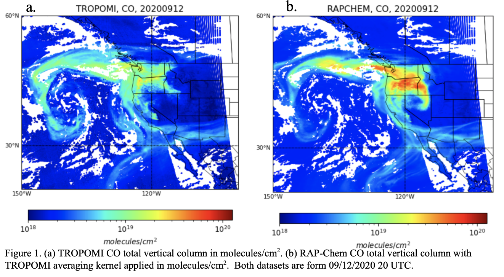
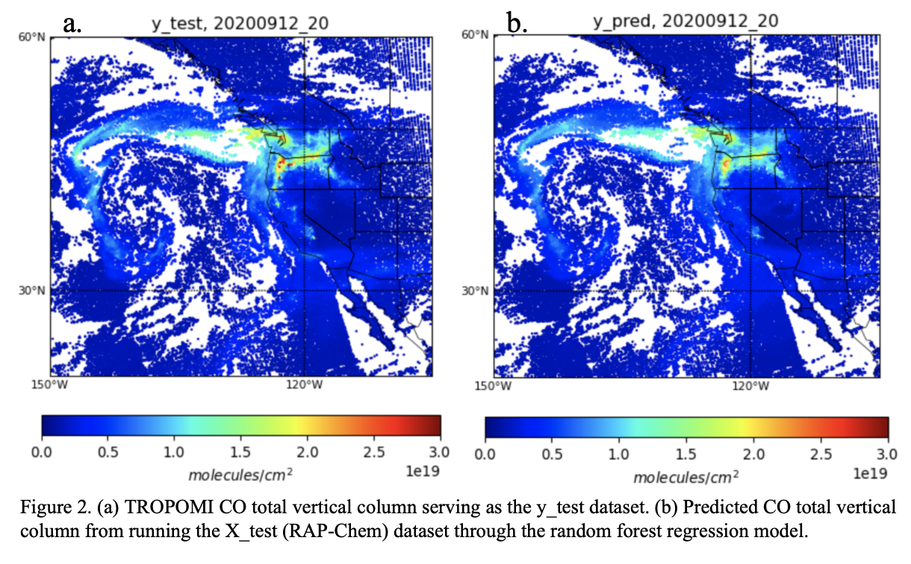
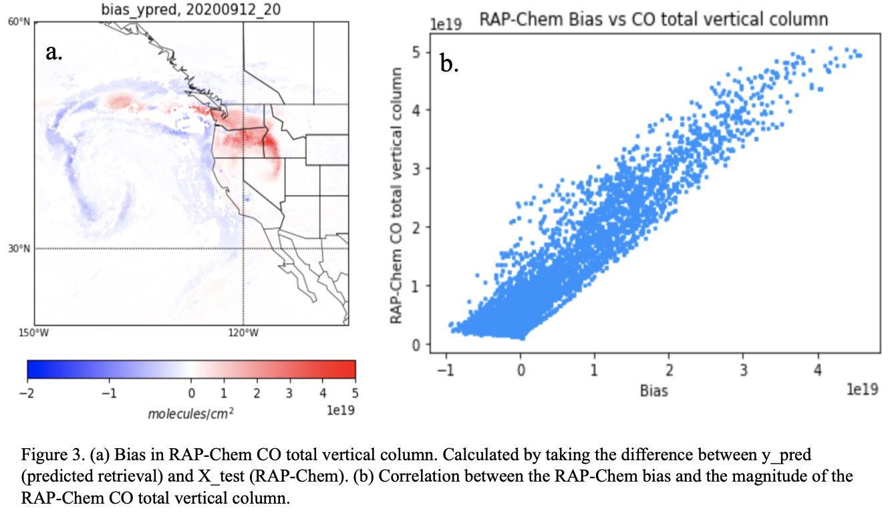
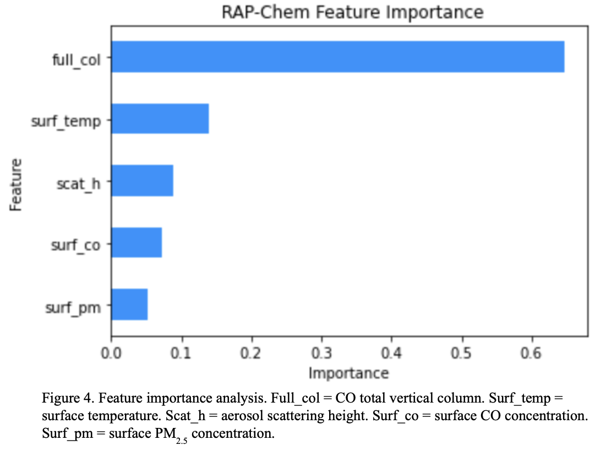
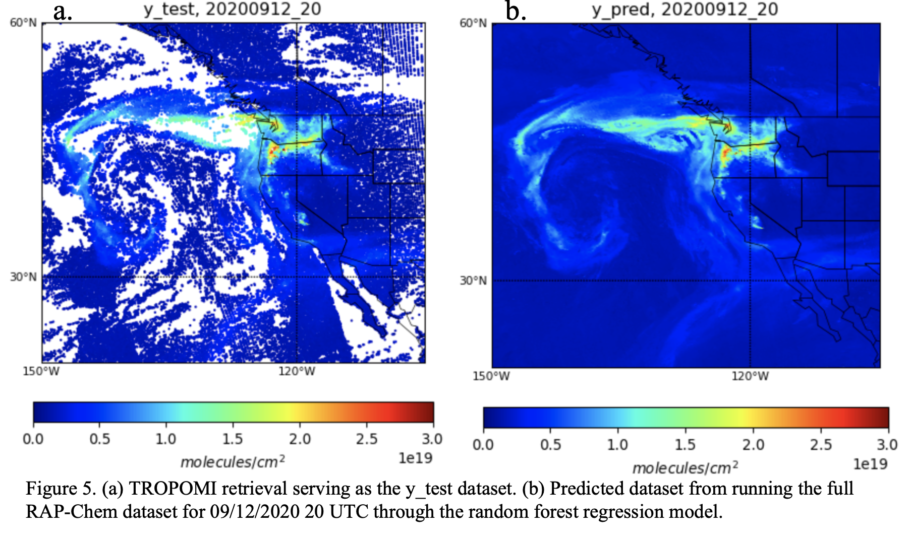
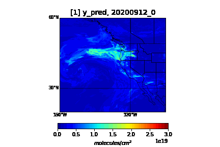
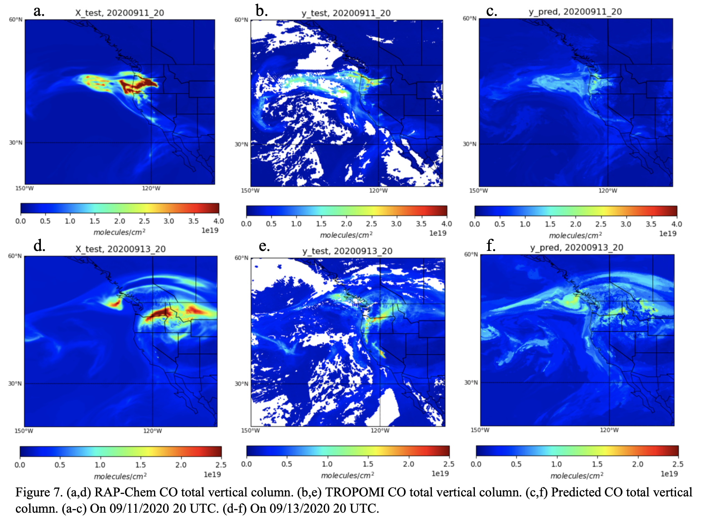

## A random forest regression model to remove RAP-Chem bias and estimate TROPOMI data when there is no retrieval available
***

## Introduction 

  Extreme wildfires are occuring more frequently, particularly in the Western United States. While there may be fewer total wildfires, these fires are burning more acreage resulting in more large, extreme fires and megafires (Congressional Budget Office, 2022). This is caused by many factors including climate change, extreme droughts, a history of poor forest management practices, and the expansion of the urban- wildland interface (Pausas et al., 2021). The state of California alone has experienced 8 of the largest wildfires, 6 of the most destructive wildfires, and 4 of the deadliest wildfires in the state’s history since 2018 (Cal FIRE, n.d.).
  
  Large and extreme wildfires are more likely to have a larger, more extensive smoke plume that injects excess smoke, gasses, and aerosols into the atmosphere (Pausas et al., 2021). These plumes can transport smoke high in the atmosphere and hundreds of kilometers downwind from the source. This problem is made worse when multiple of these extreme blazes are burning simultaneously, as in the Western US in 2020. A series of large wildfires burned over 10.2 million acres in California, Oregon, and Washington during the summer of 2020 resulting in 3,720 exceedances of the National Ambient Air Quality Standards for PM2.5 (Li et al., 2021). During extreme wildfire events this smoke can affect nearby and/or far off cities, turning the sky a sickly orange and creating a health hazard for all individuals (Casico, 2018). As these events occur with more frequency it is increasingly important to be able to accurately observe, model and predict the effects of wildfires on air quality.
  
  Satellite retrievals (from instruments such as TROPOMI) are a great observational tool to observe the large-scale transport of wildfire plumes and validate model forecasts. Unfortunately, many of these retrievals are only available once a day and have gaps in the data due to clouds. High resolution air quality forecast models (such as RAP-Chem) are another useful tool to model smoke transport on an hourly timescale, however, these models are often biased as they continue to undergo development. My previous research has shown RAP-Chem CO total vertical column to be biased compared to TROPOMI retrievals. RAP-Chem has a tendency to overestimate emissions resulting in overly large values of CO and other biomass burning emissions during extreme wildfire events.
 
  This project seeks to develop a random forest regression model to correct for bias in RAP-Chem and gain an estimate of a TROPOMI retrieval at times and locations where there is no TROPOMI data present. The model proves useful to fill in cloud gaps from TROPOMI but is not successful at gaining an estimate of TROPOMI at other times.

## Data

Data from the RAP-Chem model were used as features. Rapid Refresh with Chemistry (RAP-Chem) is an experimental forecast model that runs full chemistry currently being developed at NOAA Global Sciences Laboratory (GSL). Real-time graphical forecast outputs are available online (https://rapidrefresh.noaa.gov/RAPchem/Welcome.cgi). The dataset was retrived from a NOAA server. RAP-Chem includes wildfire emissions of gasses and aerosols computed using Fire Radiative Power (FRP) measurements. It has a resolution of 14 km x 14 km and includes parametrized plume rise due to wildfires. This means that 20% of the calculated emissions are put at the surface and the other 80% are put at a calculated injection height. The variables used as features were: CO total vertical column (molec/cm2) as shown in Figure 1b, surface CO (ppm), surface PM2.5 (micrograms/m2), surface temperature (K), and aerosol scattering height (km). The aerosol scattering height is an integrated value weighted by PM2.5 concentration to give the approximate middle height of the aerosol layer. 

The target values come from the TROPOspheric Monitoring Instrument (TROPOMI) aboard the Copernicus Sentinel-5 Precursor satellite (Veefkind et al., 2012). The data was retrived from the Copernicus Data Space Ecosystem. TROPOMI is an imaging spectrometer that measures backscatter and reflected sunlight in various spectral regions. The ground pixel size is 7 km x 7 km. TROPOMI retrieves the CO total column once a day and passes over the west coast of the US in the afternoon. TROPOMI is sensitive to the entire troposphere. The specific target variable is CO total vertical column (molec/cm2) as shown in Figure 1a. 

## Modelling

This project utilized SciKit Learn’s random forest regressor. The regressor used 100 estimators and a max depth of 12 to attempt to avoid overfitting while still capturing the spatial trends. RAP-Chem data from 09/12/2020 at 20 UTC was used as features in order to train and test the model. This was trained and tested against TROPOMI data also from 09/12/2020 at ~20 UTC. The date 09/12/2020 was chosen as the training day as there is a large, well-developed plume due to wildfires. 

To train the model I first regridded the RAP-Chem data to the TROPOMI grid using xESMF’s conservative regridding method, and removed all nan values. I divided the CO total vertical column by 1e19 so I wasn’t running extremely large numbers through the model.  I used 70% of the data as training data and 30% as testing data. 

It is worth noting that the RAP-Chem data and TROPOMI data are not immediately comparable as the satellite retrieval is not uniformly sensitive to CO at all heights. In order to directly compare the two datasets, the TROPOMI CO averaging kernel would need to be applied to the RAP-Chem data to account for the sensitivities of the satellite retrieval. As part of the goal of this project is to use to RAP-Chem data and a random forest regression to retrieve an estimate of a TROPOMI retrieval when there is no TROPOMI data available, the model will be trained and tested with RAP-Chem data without the TROPOMI averaging kernel applied. 

## Results/Discussion

I tested the random forest regressor using the test dataset. Figure 2 shows the difference between the test dataset and the predicted dataset. The two datasets are extremely similar though the predicted dataset is underpredicting the maximums over Western Oregon. The RMSE is 0.0799e19. The model performs quite well for this time though it should be noted that the testing data is from the same date and time as the training data. 

#### Bias correction

Figure 3a shows the difference between RAP-Chem (X_test) and TROPOMI (y_pred) CO total vertical columns to analyze the spatial bias present in the RAP-Chem model. RAP-Chem appears to overpredict more over the continent and closer to areas where there would be a fresh plume. Underpredictions occur more often over the ocean and particularly on the edges of the plume. These are regions where the plume would be older. 

Figure 3b shows the bias between RAP-Chem and TROPOMI CO total vertical columns (as shown in Figure 3a) plotted against the magnitude of the RAP-Chem CO total vertical column. There is a clear correlation between the bias and the total vertical column. When RAP-Chem has a higher magnitude, the bias tends to be higher whereas, when the RAP-Chem magnitude is lower the bias is small or becomes negative. This shows that RAP-Chem tends to majorly overpredict high values of CO and slightly underpredict lower values. 

#### Feature importance  

Figure 4 shows the feature importance of the RAP-Chem features included in the model. The CO total vertical column is the most important feature as expected accounting for 65% of the correlation. The other four features are remarkably close together with surface temperature, aerosol scattering height, surface co, and surface PM2.5 accounting for 14%, 9%, 7%, and 5% respectively. Despite the model trying to predict CO total vertical column, the RAP-Chem CO total vertical column accounts for just over half of the correlation, indicating the importance of the other features. 

#### Retrieve missing TROPOMI data 

The model was first tested on its ability to predict TROPOMI data from regions with cloud gaps at the same time as the training data. To test this, I ran RAP-Chem data in the RAP-Chem grid from 09/12/2020 at 20 UTC through the random forest regression to determine if it could give me an approximation of the data unavailable in TROPOMI due to clouds. The random forest regression has already been proven to perform well on RAP-Chem data for this day so this is testing if it is still successful filling in the gaps. The result is shown in Figure 5. Overall, it looks remarkably good. The plume structure appears to be nearly identical to the TROPOMI data and the cloud gaps are filled in smoothly with the random forest regression. This random forest regression is successful in filling in cloud gaps present in TROPOMI when trained with data from the same day and time as the satellite retrieval. 

The model was then tested on its ability to predict TROPOMI data for other times on 09/12/2020. RAP-Chem data from 09/12/2020 at 0-23 UTC was run through the random forest regression model and the results are shown as a gif in Figure 6. The plume in Figure 6a evolves the same as the RAP-Chem plume does in Figure 6b. As it gets close to 20 UTC (time of the training data), the plume shrinks back to the shape of the TROPOMI plume which is similar but not identical to the RAP-Chem plume’s shape. 20 UTC is also the only time where the orange and red maximum values are seen. There is no TROPOMI data available for these times so it is difficult to verify the accuracy. Going off observations alone, the plume looks moderately accurate but, as the discrepancy in the plume development near 20 UTC shows, the model is underestimating maximums and has a shape closer to that of RAP-Chem than TROPOMI. 

*Figure 6. GIF of the results of running the full RAP-Chem datasets for 09/12/2020 0-23 UTC through the random forest regression model.*

Finally, the model was tested on its ability to predict TROPOMI data on other days. Figure 7 shows the results of running the RAP-Chem data through the random forest regression model on 09/11/2020 and 09/13/2020 at 20 UTC as well as the corresponding TROPOMI retrievals. Neither predicted dataset performs exceptionally well when compared against the TROPOMI retrieval. On 09/11/2020 the larger values in TROPOMI are drastically underpredicted. This may be because the RAP-Chem CO total vertical column values are larger than the ones in the training set. The predicted dataset still maintains the approximate shape of the plume but that is more of a testament to RAP-Chem’s accuracy than the random forest regression model’s. The predicted dataset on 09/13/2020 shows similar behaviors. The maximums are still underpredicted though by a smaller margin than on 09/11/2020. The shape is also similar but matches the shape of RAP-Chem more than the shape of TROPOMI. 

## Conclusion

The random forest regression model developed in this project performs well at filling in cloud gaps at the same time as the training dataset but fails to perform accurately on other days. It successfully removes the bias on RAP-Chem on 09/12/2020 and reveals that RAP-Chem tends to have a greater bias when the total vertical column of CO is higher. RAP-Chem also tends to have a greater bias in regions with a fresh plume and a lower bias when the plume is older. The model also successfully fills in cloud gaps in the satellite retrieval on 09/12/2020. However, the model fails and generally underpredicts when trying to predict the CO total vertical column at other times and on other days. 

These results are likely a result of overfitting the data to the training set. This allows it to perform well for filling in cloud gaps at that time but results in poor performance on other days. Including data from more days in the training set would likely improve the performance. Including observational features such as AOD or observational surface CO would also improve the performance of the model and allow it to better capture the shape of the plume. The issue there is the variability in time scales and reliability of the data. The model would also benefit from more tuning of the hyperparameters. This random forest regression model shows promise in removing the bias present in RAP-Chem as well as predicting the TROPOMI retrieval when there is no data available but would benefit from a more extensive training set and the inclusion of additional observational features. 

## References

Cal FIRE. (n.d.). Statistics. https://www.fire.ca.gov/our-impact/statistics

Cascio, W. E. (2018). Wildland fire smoke and human health. Science of The Total Environment,
624, 586–595. https://doi.org/10.1016/j.scitotenv.2017.12.086

Li, Y., Tong, D., Ma, S., Zhang, X., Kondragunta, S., Li, F., & Saylor, R. (2021). Dominance of wildfires impact on air quality exceedances during the 2020 record‐breaking wildfire season in the United States. Geophysical Research Letters, 48(21). https://doi.org/10.1029/2021gl094908

Pausas, J. G., & Keeley, J. E. (2021). Wildfires and global change. Frontiers in Ecology and the Environment, 19(7), 387–395. https://doi.org/10.1002/fee.2359

Veefkind, J. P., Aben, I., McMullan, K., Förster, H., de Vries, J., Otter, G., Claas, J., Eskes, H. J., de Haan, J. F., Kleipool, Q., van Weele, M., Hasekamp, O., Hoogeveen, R., Landgraf, J., Snel, R., Tol, P., Ingmann, P., Voors, R., Kruizinga, B., ... Levelt, P. F. (2012). Tropomi on the ESA sentinel-5 precursor: A GMES mission for global observations of the atmospheric composition for climate, air quality and ozone layer applications. Remote Sensing of Environment, 120, 70–83. https://doi.org/10.1016/j.rse.2011.09.027

Wildfires. Congressional Budget Office. (2022, June). Retrieved March 20, 2023, from https://www.cbo.gov/publication/58212

[back](./)

